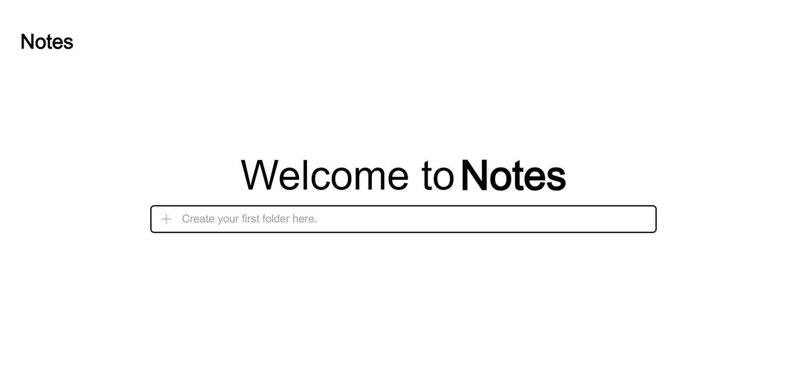
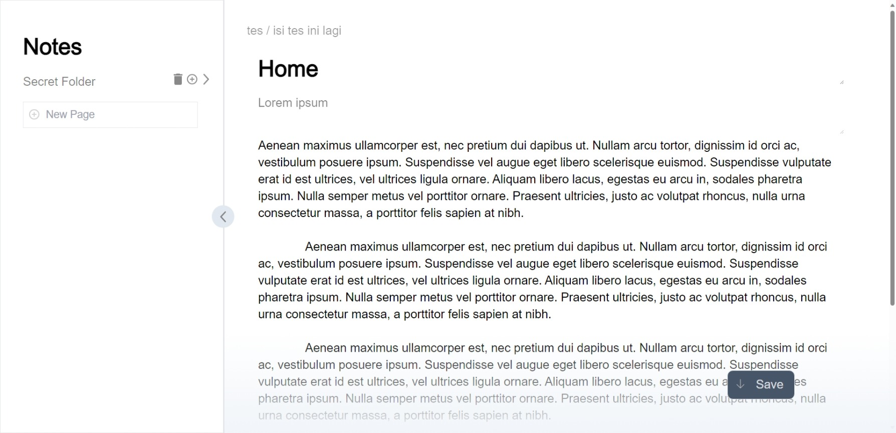

# Notes Application with Next.js and Firebase

A simple Notes application built using Next.js and Firebase. This application allows users to create, edit, and delete notes in real-time.

<div style="display:flex; justify-content: space-between;">
  
  
</div>

## Features

- **Data Storage:** Storage of user notes using Firebase Firestore, a document-based database.
- **Dynamic Views:** Using Next.js for server-side rendering to ensure fast and dynamic views.

## How to Run the Application

1. Clone the repository to your local machine:

   ```bash
   git clone https://github.com/username/repo-name.git
   ```

2. Install dependencies:

   ```bash
   cd notes-nextjs
   npm install
   ```

3. Configure Firebase:
   Create a new project on the Firebase Console.
   Enable Firestore and Firebase Authentication.
   Copy the Firebase configuration to the .env file:
   ```bash
   NEXT_PUBLIC_FIREBASE_API_KEY=your-api-key
   NEXT_PUBLIC_FIREBASE_AUTH_DOMAIN=your-auth-domain
   ```
4. Run the application
   ```bash
   npm run dev
   ```
   The application will run at http://localhost:3000.
